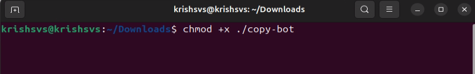
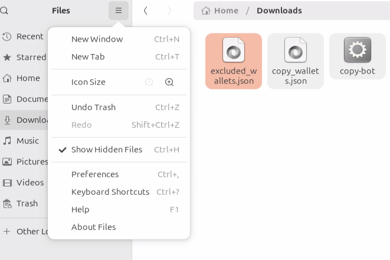
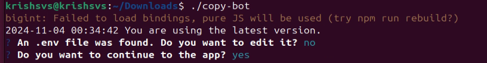

# Quick Start Guide

Download the latest version of the copy bot

Right click in blank space and select open in Terminal

In the New Terminal Window – Make sure it is pointing to the folder where you downloaded the copy bot

Run chmod +x command

Run ./copy-bot

On your first run it will create 2 files\
copy\_wallets.json\
excluded\_wallets.json\

Instructions to update these files are in the configuration sections of this guide - [Configuration](configuration.md)

Run ./copy-bot – again

It will create a .env file and walk you through the wizard to update all values

You can also open the .env file in notepad to verify it contents or make changes in the future.

If you do not see the .env file in the folder make sure – show hidden files option is checked.

Once all the files are updated – you can start the bot using the ./copy-bot command

If you see this screen – Congratulations, you have successfully setup the copy bot and it is now watching for transactions on your target wallets to replicate

