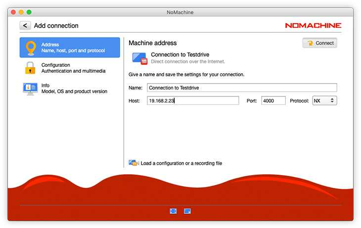

# Wrapping Sol to wSOL

To use the Tachyon Copybot, you'll need both SOL and Wrapped SOL (wSOL) in your wallet. SOL is used for gas fees, and wSOL is used for trading. Follow these steps to wrap SOL using Jupiter:

1.  **Visit Jupiter**

    Open your web browser and go to [Jupiter](https://jup.ag/).

<figure><figcaption></figcaption></figure>

1.  **Connect Your Wallet**

    Click on the button to connect your wallet. Follow the prompts to authorize the connection.

<figure><figcaption></figcaption></figure>

1.  **Change Swap Settings**

    * Click on the gear-shaped button to open the swap settings.

    <figure><figcaption></figcaption></figure>

    * Turn on the option to "Use WSOL.

    <figure><figcaption></figcaption></figure>

    * Click "Save Settings" to apply the changes.
2.  **Check SOL and wSOL Balance**

    Once your wallet is connected, you will be able to see the balance of SOL and wSOL in your wallet.
3.  **Wrap SOL**

    * Click on the "Manage" button.

    <figure><figcaption></figcaption></figure>

    * Enter the amount of SOL you want to wrap.
    * Click "Wrap SOL" to convert your SOL into wSOL.

    <figure><figcaption></figcaption></figure>
4.  **Verify Balance**

    After wrapping, verify that you have both SOL and wSOL in your wallet. SOL will be used for gas fees, and wSOL will be used for trading.

By following these steps, you ensure that your wallet is properly set up with the necessary SOL and wSOL to operate the Tachyon Copybot effectively.
