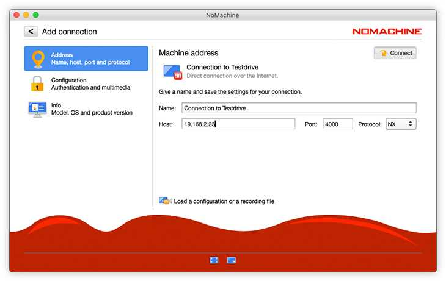

# Hetzner VPS Setup & NoMachine RDP Guide

 (1).png>)

 (1).png>)

 (1).png>)

 (1).png>)

 (1).png>)

 (1).png>)

 (1).png>)

 (1).png>)

 (1).png>)

.png>)

.png>)

.png>)

.png>)

.png>)

.png>)

Optionally - You can install Ubuntu Desktop on your VPS using "sudo apt-get install ubuntu-desktop"

NoMachine to enable a better Remote Desktop solution to manage your VPS.

To install NoMachine, you need to download the `.deb` package from its [official website](https://downloads.nomachine.com/linux/?id=1). Considering the modern infrastructure of _Hetzner Cloud_, you probably need to download the `amd64` architecture. If you're not sure, you can use `dpkg --print-architecture` to get your architecture.

At the time of writing this tutorial, the latest version (8.8) of NoMachine can be downloaded with the following command:

```bash
wget https://download.nomachine.com/download/8.8/Linux/nomachine_8.8.1_1_amd64.deb
```

Then, install the `.deb` package:

```bash
sudo dpkg -i nomachine_8.8.1_1_amd64.deb
```

Finally, check out the [NoMachine download page](https://downloads.nomachine.com/), and install the NoMachine client based on your local device that will connect to the server. Run the NoMachine client in the local device, click the `Add` button, fill the host with your server's public IP address, and leave other parameters as default.

<figure><figcaption></figcaption></figure>

Next, click the `Connect` button and enter your Ubuntu username (e.g., `root` as default) and password. If you've not set the password yet, you can simply do it interactively with `passwd` command.

Link for More Advanced Instructions for NoMachine [https://kb.nomachine.com/DT07S00245](https://kb.nomachine.com/DT07S00245)
